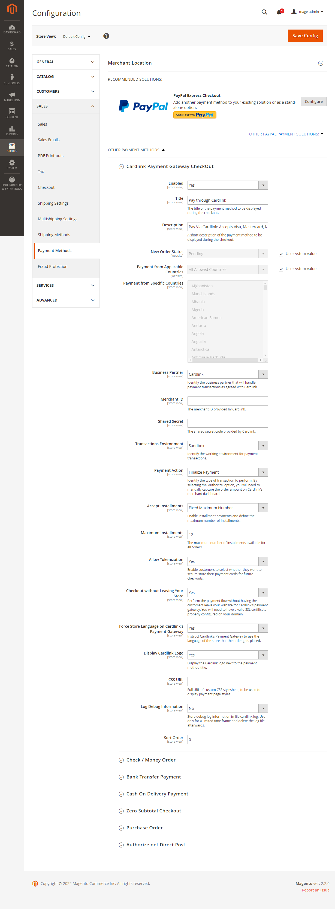
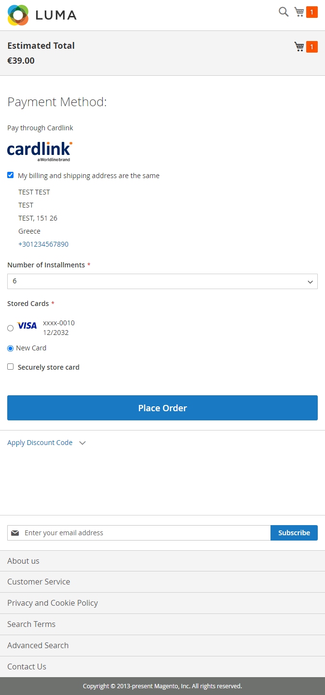

# Cardlink Checkout Payment Gateway for Magento 2.x

- Contributors: cardlink
- Tags: payments, payment-gateway
- Requires at least: 2.2.6
- Tested up to: 2.4.7
- Requires PHP: 7.x - 8.x
- License: GPLv2 or later
- License URI: http://www.gnu.org/licenses/gpl-2.0.html

## Changelog

- **1.0.5**
  - Fixed guest checkout bug.

- **1.0.4**
  - Minor bug fixes.

- **1.0.3**
  - Order creation only happens after successful payment.
  - Fixed bug with credit memo creation.
  - Fixed bug with reorder in admin.

- **1.0.2**
  - Fixed a bug that failed checkout with PayPal Standard.
  - Changed auto cancel order period to 60 minutes.

- **1.0.1**
  - Only send order confirmation email to customer when the order has been successfully paid for.
  - Auto cancel order after 30 minutes in pending payment state.

- **1.0.0**
  - Initial release

## Description

Cardlink Payment Gateway allows you to accept payment through various schemes such as Visa, Mastercard, Maestro, American Express, Diners, Discover cards on your website, with or without variable installments.
This module aims to offer new payment solutions to Cardlink merchants for their Magento 2.x online store without having web development knowledge. However, for the initial module installation some technical knowledge will be required.

Merchants with e-shops (redirect cases only) will be able to integrate the Cardlink Payment Gateway to their checkout page using the CSS layout that they want. Also, they could choose between redirect or IFRAME option for the payment environment. Once the payment is made, the customer returns to the online store and the order is updated.
Once you have completed the requested tests and any changes to your website, you can activate your account and start accepting payments. 

## Features

1. A dropdown option for instance between Worldline, Nexi και Cardlink.
2. Option to enable test environment (sandbox). All transactions will be re-directed to the endpoint that represents the production environment by default. The endpoint will be different depending on which acquirer has been chosen from instance dropdown option.
3. Ability to define the maximum number of installments regardless of the total order amount.
4. Ability to define the ranges of the total order amounts and the maximum number of installments for each range.
5. Option for pre-authorization or sale transactions.
6. Option for a user tokenization service. The card token will be stored at the merchant’s e-shop database and will be used by customers to auto-complete future payments. 
7. In-store checkout option: the merchant can configure the payment process to take place inside a pop up with IFRAME to mask the redirection process from the customers.
8. A text field for providing the absolute or relative (to Cardlink Payment Gateway location on server) URL of custom CSS stylesheet, to apply custom CSS styles in the payment page.
9. Translation ready for Greek & English languages.
10. Automatically cancel pending payment orders after 60 minutes.
11. Only send the order confirmation email to the customer after a successful payment.

## Installation

You need to manually upload the contents of the .zip file of the module’s latest version to your server’s web root folder that your Magento store is installed. You will first need to extract the file’s contents to a temporary folder. Then, go to the ``Cardlink\Checkout\Controller\Payment`` folder. Replace the Response.php file with the file that corresponds to your installed Magento version, ``Response-v2.2.php`` for any 2.2.x version and ``Response-v2.3.php`` for any version 2.3.x-2.4.x.

Depending on your hosting provider, you will probably have to be familiar with the process of transferring files using an FTP or SFTP client. If no FTP/SFTP access is provided, use your hosting provider’s administration panel to upload the folders to the folder of your Magento installation. 

Using an SSH console, go to your web root folder (or the folder your Magento store is installed) and execute the following commands to enable the extension and execute its installation scripts.

```
# bin/magento module:enable Cardlink_Checkout 
# bin/magento setup:upgrade
# bin/magento setup:di:compile
```

### Required Hosting Settings 

For security reasons, Web browsers will not send target domain cookies when the referrer website is on another domain and data are POSTed unless the ``SameSite`` option of these cookies is set to the value ``None``. If you fail to properly configure the required hosting settings, customers returning from the payment gateway will be automatically logged out from their accounts. The following configuration instructions will manipulate all cookies set by your store to allow customer sessions to persist after returning from the payment gateway.

#### Apache Web Server

For hosting solutions running the Apache web server software, you will need to add the following lines to your web site’s root ``.htaccess`` file. Make sure the ``mod_headers`` Apache module is installed and active.

```
<IfModule mod_headers.c>
Header always edit Set-Cookie ^(.*)$ $1;SameSite=None;Secure
</IfModule>
```

#### Nginx Web Server

If your hosting provider uses the Nginx web server instead, you will need to add/edit the following lines of code to your virtual host’s configuration file.

```
location / {
    proxy_cookie_path / "/; SameSite=None; Secure";
    …
}
```

#### Plesk Hosting Control Panel

If you are using Plesk and nginx in proxy mode, under ``Apache & nginx Setting for ... > Additional nginx directives`` add only the following line:

```
proxy_cookie_path / "/; SameSite=None; Secure";
```

If you are only using Apache, add the following configuration lines in the ``Additional Apache directives`` section on the same page. By default, Plesk has the Apache ``mod_headers`` module installed and active however, verify that this is the case for your Plesk installation.

```
<IfModule mod_headers.c>
Header always edit Set-Cookie ^(.*)$ $1;SameSite=None;Secure
</IfModule>
```


If you are unsure or unfamiliar with the actions described above, please ask a trained IT person or contact your hosting provider to do them for you.

## Screenshots

1. The Cardlink Payment Gateway settings screen used to configure the main Cardlink gateway (``Stores > Configuration > Sales > Payment Methods``).



2. This is the front-end of Cardlink Payment Gateway plugin located in checkout page



##  Support tickets

In case that you face any technical issue during the installation process, you can contact the Cardlink e-commerce team at ecommerce_support@cardlink.gr .
